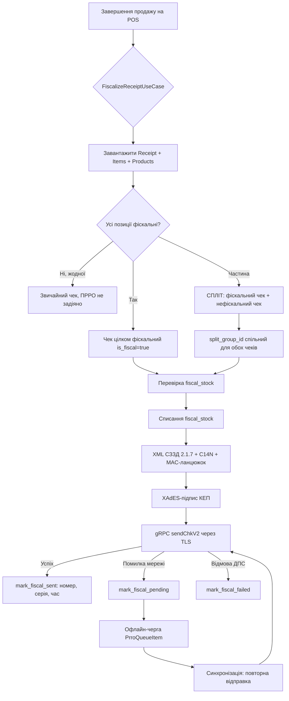

# ADR 013: Архітектура ПРРО-модуля (фіскалізація чеків через ДПС України)

## Статус
✅ Прийнято

## Контекст

**Навіщо ПРРО:** Kasa POS — система обліку роздрібної торгівлі. Згідно із законодавством
України, розрахункові операції (продаж/повернення) мають фіскалізуватися — реєструватися
у податковій. ПРРО (програмний реєстратор розрахункових операцій) — це програмне рішення,
що формує фіскальні чеки у форматі СЗЗД, підписує їх кваліфікованим електронним підписом
(КЕП) та передає на фіскальний сервер ДПС України.

**Вимоги користувача:**
1. Фіскалізація лише товару, який оприбуткований за фіскальною накладною
   (`Product.is_fiscal` + контроль `fiscal_stock`).
2. Політика при нестачі `fiscal_stock` — **часткова фіскалізація**: чек розділяється на
   фіскальні позиції (→ ПРРО) та нефіскальні (→ звичайний чек), зв'язок через `split_group_id`.
3. Підтримка будь-якого формату ключа КЕП: `dat` / `pfx` / `jks` / `pem`.
4. Робота в офлайн-режимі з подальшою синхронізацією (ліміт 168 годин).

**Обмеження протоколу ДПС:**
- Транспорт: **gRPC** (proto3), сервіс `ChkIncomeService`, метод `sendChkV2`
  (метод `sendChk` діє лише до 01.10.2021).
- Тестове API: `cabinet.tax.gov.ua:9443` (чеки НЕ фіскальні); бойове: `prro.tax.gov.ua:443`.
- XML-формат: **СЗЗД 2.1.7** — чек `<C T="0|1">`, Z-звіт `<Z>`, службові чеки `Т=108–112`.
- Підпис: **XAdES** (КЕП), канонічний вигляд XML (C14N), MAC-хеш-ланцюжок (кожен чек
  містить хеш попереднього).
- Для відкриття зміни `local_number == 0`; для перевірки зв'язку `local_number == 0x7FFFFFFF`.

**Що вже є в проєкті (незакомічені зміни):**
- `Product.is_fiscal / fiscal_stock / uktzed`
- `Receipt.is_fiscal / fiscal_status (none|pending|sent|failed) / fiscal_number /
  fiscal_serial / fiscal_sent_at / fiscal_error / split_group_id`
- `ReceiptItem.fiscal_quantity`
- `Invoice.is_fiscal`, `ReturnInvoice.is_fiscal`
- Міграції `f89706f0cc25`, `f89706f0cc26`

---

## Рішення

Реалізувати **ПРРО-модуль у Clean Architecture** як ізольований функціональний модуль,
що підпорядковується Dependency Rule (нижчі шари не знають про вищі).

### 1. Схема шарів модуля

```
┌────────────────────────────────────────────────────────────────────────────┐
│  PRESENTATION  (api/v2/prro.py)                                            │
│  ┌──────────────────────────────────────────────────────────────────────┐  │
│  │  POST /api/v2/prro/shifts/open        — відкрити зміну (Т=108)      │  │
│  │  POST /api/v2/prro/shifts/{id}/close  — закрити зміну (Z-звіт)      │  │
│  │  POST /api/v2/prro/receipts/fiscalize — фіскалізувати чек            │  │
│  │  GET  /api/v2/prro/queue              — офлайн-черга                 │  │
│  │  POST /api/v2/prro/queue/sync         — синхронізація черги          │  │
│  │  GET  /api/v2/prro/settings           — налаштування (ключі, ФН)     │  │
│  └──────────────────────────────────────────────────────────────────────┘  │
├────────────────────────────────────────────────────────────────────────────┤
│  APPLICATION  (application/use_cases/prro/*)                               │
│  ┌──────────────────────────────────────────────────────────────────────┐  │
│  │  OpenShiftUseCase        — відкриття зміни, старший касир            │  │
│  │  FiscalizeReceiptUseCase — фіскалізація чека (sale/return), спліт    │  │
│  │  CloseShiftUseCase       — Z-звіт, закриття зміни                    │  │
│  │  SyncOfflineQueueUseCase — синхронізація офлайн-черги                │  │
│  │  PrroSettingsUseCase     — CRUD налаштувань (key-value)              │  │
│  └──────────────────────────────────────────────────────────────────────┘  │
├────────────────────────────────────────────────────────────────────────────┤
│  DOMAIN                                                                     │
│  ┌──────────────────────────────────────────────────────────────────────┐  │
│  │  Entities:  Product (is_fiscal, fiscal_stock, uktzed),              │  │
│  │             Receipt (fiscal_status, split_group_id, ...),           │  │
│  │             ReceiptItem (fiscal_quantity)                           │  │
│  │  Repositories (ports): IPrroSettingRepository, IPrroShiftRepository,│  │
│  │                        IPrroQueueRepository, IReceiptRepository     │  │
│  └──────────────────────────────────────────────────────────────────────┘  │
├────────────────────────────────────────────────────────────────────────────┤
│  INFRASTRUCTURE  (infrastructure/services/prro/)                            │
│  ┌──────────────────────────────────────────────────────────────────────┐  │
│  │  prro.proto      — опис gRPC-інтерфейсу ДПС (proto3)                │  │
│  │  grpc_client.py  — асинхронний клієнт (grpcio.aio), таймаути,       │  │
│  │                    ретраї (2–3 спроби, експоненційний бек-оф)        │  │
│  │  xml_builder.py  — побудова XML СЗЗД 2.1.7 (чек <C>, Z-звіт <Z>,   │  │
│  │                    службові <T=108–112>), канонічний вигляд,        │  │
│  │                    MAC-хеш-ланцюжок                                  │  │
│  │  crypto_signer.py— XAdES-підпис (КЕП), верифікація                  │  │
│  │  key_store.py    — зберігання ключа КЕП (шифрування at-rest)        │  │
│  │  offline_queue.py— офлайн-черга PrroQueueItem, резервні номери       │  │
│  └──────────────────────────────────────────────────────────────────────┘  │
│  Persistence: infrastructure/persistence/models/prro.py                    │
│  └── PrroSetting, PrroShift, PrroQueueItem + репозиторії                    │
└────────────────────────────────────────────────────────────────────────────┘
```

**Принципи розміщення:**
- **Domain** містить лише сутності та порти (інтерфейси репозиторіїв). Жодних імпортів
  з Infrastructure/Presentation.
- **Application** (use cases) оркеструє потік: валідація → виклик репозиторіїв →
  виклик сервісів через інтерфейси (порти) → оновлення статусів.
- **Infrastructure** реалізує порти: gRPC-клієнт, XML-білдер, криптосервіс, сховище ключів,
  офлайн-чергу, SQLAlchemy-моделі. Залежить від Domain та Application (через DI).
- **Presentation** (api/v2/prro.py) — лише HTTP-обгортка над use cases, без бізнес-логіки.

### 2. Модель даних

#### 2.1. Нові моделі (infrastructure/persistence/models/prro.py, таблиці `prro_*`)

| Модель | Таблиця | Ключові поля | Призначення |
|--------|---------|--------------|-------------|
| **PrroSetting** | `prro_settings` | `key_name` (unique, index), `value` (Text), `updated_at` | Налаштування ПРРО: `key_file`, `key_password_encrypted`, `key_format` (dat/pfx/jks/pem), `prro_fn`, `prro_tn`, `prro_zn`, `mode` (test/prod), `url`, `last_shift_number`, `last_local_number` |
| **PrroShift** | `prro_shifts` | `id` (UUID), `shift_number` (унікальний локальний), `status` (open/closed), `opened_at`, `closed_at`, `cashier_id` (підписант), `z_report_number`, `local_numbers_range`, `receipt_count`, `fiscal_total` | Касова зміна ПРРО: один підписант на зміну, старший касир відкриває/закриває |
| **PrroQueueItem** | `prro_queue_items` | `id` (UUID), `shift_id` (FK→prro_shifts), `receipt_id` (FK→receipts), `doc_type` (CHK/ZREPORT/SERVICECHK), `xml_doc` (Text), `local_number`, `status` (pending/sent/failed), `attempts`, `created_at`, `sent_at`, `error`, `reserve_number` | Офлайн-черга фіскальних документів, що не передані в ДПС |

Зв'язки:
- `PrroShift 1──N PrroQueueItem` (зміна → документи зміни)
- `Receipt 1──1 PrroQueueItem` (чек → документ черги)
- `PrroSetting` — незалежна key-value таблиця

#### 2.2. Розширення існуючих моделей (вже в міграціях f89706f0cc25/f89706f0cc26)

**Product** (`products`):
- `is_fiscal: bool` — товар оприбуткований за фіскальною накладною
- `fiscal_stock: float | None` — залишок фіскального стоку (зменшується при фіскалізації)
- `uktzed: str | None` — код УКТЗЕД (обов'язковий для фіскальних чеків)

**Receipt** (`receipts`):
- `is_fiscal: bool` — чек містить лише фіскальні позиції
- `fiscal_status: enum(none|pending|sent|failed)` — стан відправки в ДПС
- `fiscal_number: str | None`, `fiscal_serial: str | None` — номер/серія від ДПС
- `fiscal_sent_at: datetime | None` — час успішної відправки
- `fiscal_error: str | None` — текст помилки
- `split_group_id: UUID | None` (FK→receipts.id) — зв'язок між фіскальним та нефіскальним
  чеками однієї продажі (спліт)

**ReceiptItem** (`receipt_items`):
- `fiscal_quantity: float` — фіскалізована кількість позиції:
  - `0` = нефіскальна,
  - `0 < fiscal_quantity < quantity` = часткова фіскалізація,
  - `= quantity` = повністю фіскальна

**Invoice / ReturnInvoice**: `is_fiscal: bool` — накладна (прихід) є фіскальною.

### 3. Потік фіскалізації чека (sale/return)

```
Користувач завершує продаж на POS
        │
        ▼
[Application] FiscalizeReceiptUseCase.execute(receipt_id)
        │
        ├─ 1. Завантажити Receipt + ReceiptItems + Products
        ├─ 2. Для кожної позиції: Product.is_fiscal? → фіскальна/нефіскальна
        │
        ├─ УМОВА: усі позиції фіскальні
        │     → чек цілком фіскальний (is_fiscal=True)
        │
        ├─ УМОВА: жодної фіскальної позиції
        │     → звичайний чек, ПРРО не задіяно
        │
        └─ УМОВА: частина позицій фіскальна (часткова фіскалізація)
              → СПЛІТ:
                1) Новий фіскальний чек (копія чека, лише фіскальні позиції,
                   fiscal_quantity=quantity)
                2) Поточний чек → нефіскальний (лише нефіскальні позиції,
                   fiscal_quantity=0)
                3) Обидва чеки отримують спільний split_group_id
        │
        ▼
[Application] Перевірка fiscal_stock для кожної фіскальної позиції
        │   (Product.update_fiscal_stock(-quantity), заборона нижче нуля)
        │
        ▼
[Infrastructure] xml_builder.build_check(receipt, shift, items)
        │   → XML СЗЗД 2.1.7: <C T="0"|"1">, канонічний вигляд (C14N),
        │     MAC-хеш-ланцюжок (hash попереднього чека зміни)
        ▼
[Infrastructure] crypto_signer.sign_xades(xml, key, password)
        │   → XAdES-підпис (КЕП)
        ▼
[Infrastructure] grpc_client.send_chk_v2(check)
        │   → ChkIncomeService.sendChkV2 (TLS)
        │
        ├─ УСПІХ → Receipt.mark_fiscal_sent(fiscal_number, fiscal_serial)
        │          PrroShift.receipt_count++, фіскальний сток списано
        │
        ├─ ПОМИЛКА МЕРЕЖІ → Receipt.mark_fiscal_pending()
        │          → offline_queue.enqueue(PrroQueueItem) → статус pending
        │
        └─ ВІДМОВА ДПС → Receipt.mark_fiscal_failed(error)
                   → чек у черзі failed, повторна спроба/ручне втручання
```

#### Mermaid-діаграма потоку фіскалізації



**Повернення (return):** той самий потік, але `T="1"` (чек повернення), суми від'ємні,
`fiscal_stock` збільшується на повернену кількість. Прив'язка до оригінального чеку
через `original_receipt_id`.

### 4. Життєвий цикл зміни ПРРО

```
Відкриття зміни (Т=108)           Робота (чеки)              Закриття (Z-звіт)
┌──────────────────────┐    ┌──────────────────────┐    ┌──────────────────────┐
│ OpenShiftUseCase     │    │ FiscalizeReceipt     │    │ CloseShiftUseCase    │
│ • старший касир      │───▶│ • sale <C T="0">     │───▶│ • Z-звіт <Z>         │
│ • local_number = 0   │    │ • return <C T="1">   │    │ • MAC-ланцюжок       │
│ • один підписант     │    │ • службові Т=109-111 │    │ • надсилається в ДПС │
│ • PrroShift OPEN     │    │ • локальні номери    │    │ • PrroShift CLOSED   │
└──────────────────────┘    │   1,2,3,...          │    │ • новий номер зміни  │
                            └──────────────────────┘    └──────────────────────┘
```

Правила:
- **Один підписант на зміну** — ключ КЕП фіксується при відкритті зміни, заміна
  протягом зміни неможлива (вимога ДПС).
- **Старший касир** (роль `senior_cashier`) має право відкривати/закривати зміни;
  звичайний касир — лише фіскалізувати чеки в межах відкритої зміни.
- Локальна нумерація чеків наростає в межах зміни; резервний діапазон — для офлайну.
- Одночасно може бути відкрита **лише одна** зміна.

### 5. Офлайн-стратегія

- При втраті зв'язку з ДПС чек **не блокується**: формується повний XML, підписується,
  але замість відправки кладеться в **PrroQueueItem** (status=pending) з резервним
  номером (Т=112 — службовий чек "резервний номер").
- **Ліміт 168 годин (7 діб)** — законодавча вимога: якщо чек не передано протягом
  168 год з моменту операції, ПРРО блокується до синхронізації. Use case перевіряє
  `created_at` найстарішого pending-елемента.
- **Синхронізація** (`SyncOfflineQueueUseCase`): при відновленні зв'язку черга
  відправляється у порядку локальних номерів (MAC-ланцюжок зберігає порядок),
  статус → sent, резервний номер замінюється фіскальним.
- Обмеження черги: розмір, кількість спроб (`attempts`), dead-letter після N спроб.

### 6. Безпека

| Аспект | Рішення |
|--------|---------|
| **Ключ КЕП at-rest** | `key_store.py` зберігає ключ зашифрованим (AES-GCM); пароль — у `PrroSetting.key_password_encrypted`, зашифрований **master-key** (змінна середовища/файл поза репозиторієм) |
| **Ключ у пам'яті** | Завантажується лише на час підписання, очищується після операції |
| **Логування** | Пароль і вміст ключа НІКОЛИ не логуються; у логах — лише `key_format`, `key_fingerprint`, статуси |
| **TLS** | gRPC-канали тільки з TLS (443/9443); сертифікати ДПС верифікуються; підтримка mTLS якщо потрібно |
| **Рольова модель** | `senior_cashier` — відкриття/закриття змін, налаштування; `cashier` — фіскалізація; `admin` — керування ключами |
| **Аудит** | Всі операції ПРРО (відкриття/закриття зміни, фіскалізація, зміна налаштувань) пишуться в журнал аудиту з user_id |

---

## Альтернативи, що розглядалися

| Альтернатива | Чому відхилена |
|--------------|----------------|
| **HTTP/JSON замість gRPC** | Протокол ДПС визначає gRPC (proto3, `ChkIncomeService.sendChkV2`). HTTP/JSON не підтримується фіскальним сервером — несумісно. |
| **Синхронний запит (без черги)** | Блокує касу при втраті зв'язку, порушує законодавчий ліміт офлайну; черга необхідна для 168-годинного режиму. |
| **Повна фіскалізація або відмова в продажі** | Користувач обрав часткову фіскалізацію: продаж нефіскального товару не має блокуватися нестачею фіскального стоку інших позицій. |
| **Окремий мікросервіс ПРРО** | Для поточного масштабу (одна БД, один backend) модуль у Clean Architecture простіший: спільні транзакції з Receipt, менше операційних витрат. |
| **Зберігання ключа в БД відкрито** | Порушує вимоги безпеки КЕП — ключ і пароль шифруються at-rest (AES-GCM + master-key). |
| **Використання старого `sendChk`** | Метод діє лише до 01.10.2021 — використовуємо `sendChkV2`. |

---

## Наслідки

✅ **Переваги:**
- Фіскалізація як ізольований модуль Clean Architecture — не ламає існуючі шари
- Часткова фіскалізація зберігає продажі при нестачі фіскального стоку
- Офлайн-черга відповідає законодавчому ліміту 168 год
- Підтримка всіх форматів ключа (dat/pfx/jks/pem) — гнучкість для користувача
- Безпечне зберігання ключів (шифрування at-rest, master-key)

⚠️ **Ризики та обмеження:**
- **Складність криптографії** — XAdES, C14N, MAC-ланцюжок потребують ретельного
  тестування проти тестового API ДПС (чеки на тестовому API не фіскальні)
- **Зміна протоколу ДПС** — формат СЗЗД може оновлюватися; модуль має бути готовий
  до версіонування XML-білдера
- **Часткова фіскалізація** ускладнює звітність: фіскальний та нефіскальний чеки
  однієї продажі пов'язані лише через `split_group_id` (потрібна консолідація у звітах)
- **Один підписант на зміну** — зміна ключа можлива лише між змінами
- **Блокування після 168 год** — потребує моніторингу та сповіщення користувача
- Залежність від доступності серверів ДПС (зовнішній фактор)

---

> **Документ створено:** System Architect Agent (AEGIS v3) — Фаза 0.4  
> **Дата:** 2026-08-01  
> **Пов'язані документи:** docs/architecture/prro_module.md, docs/plan_prro.md, ADR-001 (Clean Architecture)
