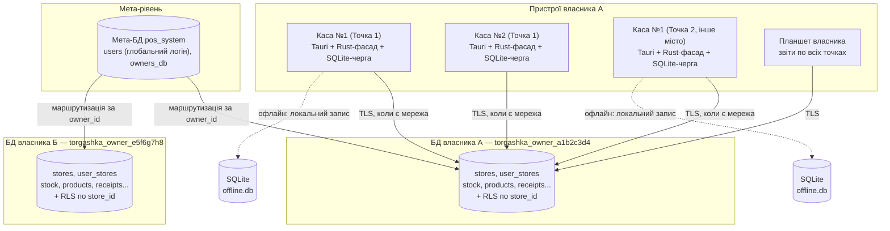
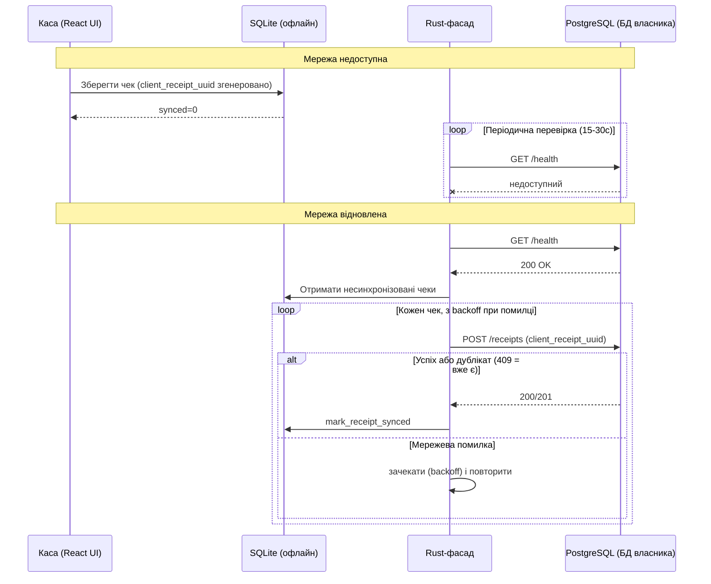

# Архітектура бази даних Torgashka POS: аналіз варіантів і рекомендоване рішення

> Статус: АНАЛІЗ + РЕКОМЕНДАЦІЯ
> Дата: 2026-09-01
> Підготовлено на основі прямого аналізу репозиторію `KASA-feat-rust-migration`
> Стек: Rust-фасад (axum, крейти `torgashka-*`) + React + Tauri + PostgreSQL 15-17 + SQLite (офлайн)

---

## 0. Короткий підсумок

Ви вже **обрали і частково реалізували** правильний напрямок: не одна централізована БД «в лоб» і не повна децентралізація, а **гібридна offline-first модель** — PostgreSQL як єдине джерело істини + локальний SQLite-кеш/черга на кожній касі, який синхронізується при відновленні мережі. Це підтверджують ваші власні файли: `docs/design/multi-store-and-cash-operations.md` (статус ПРОПОЗИЦІЯ → `docs/design/multi-store-implementation-plan.md`, статус ЗАТВЕРДЖЕНО), таблиці `stores`/`user_stores`/`stock` з RLS-політиками (`0004_rls.py`), офлайн-шар `torgashka-infrastructure/src/offline/db.rs`, і навіть заготовка під **окрему БД для кожного власника** (`owners_db`, `create_owner_db.sql`, `repositories/setup.rs`).

Головний висновок цього документа: **не змінювати архітектурний напрямок, а довести його до кінця й закрити конкретні прогалини**, які я знайшов у коді (перелічені з посиланням на файли в розділі 9). Найкритичніша з них: RLS зараз **фактично не працює**, бо застосунок підключається до БД під роллю власника таблиць/суперкористувача, який автоматично обходить RLS-політики (це прямо задокументовано коментарем у `setup.rs:23-27`, але не виправлено).

Нижче — повний аналіз варіантів (як ви просили: централізована, децентралізована, автономна децентралізована з синхронізацією та інші), порівняльна таблиця, і детальний опис рекомендованого рішення.

---

## 1. Вимоги, які визначають вибір архітектури

Це не «звичайний» CRUD-застосунок — це фіскальний касовий апарат, і це змінює пріоритети:

| # | Вимога | Чому критично для КАСА |
|---|--------|------------------------|
| 1 | **Продаж не може зупинитись через відсутність інтернету** | Закон України (ПРРО) прямо дозволяє офлайн-режим до **168 годин**, ви це вже реалізували (`ERROR_OFFLINE_168`, `docs/PRRO_IMPLEMENTATION_PLAN.md:177`). Архітектура БД зобов'язана підтримувати цей режим, а не лише фіскальна черга. |
| 2 | **Фінансові дані не можуть «розійтись» між пристроями** | Подвійне списання залишку, дублікат чека при повторній синхронізації, розбіжність каси при інкасації — це не баги, а фінансові втрати і потенційні проблеми з податковою. |
| 3 | **Встановлення — некваліфікованим користувачем** | Малий магазин: один касир ставить `.exe`/`.deb`, БД має піднятись сама. Це ви вже врахували (embedded PostgreSQL, `embedded_pg.rs`). |
| 4 | **Масштаб — від 1 каси до мережі точок у різних містах** | Поточна модель (store_id + RLS) закриває «мережа точок в одній БД». Але мультимісто/хмара поки не описані окремо — додаю нижче. |
| 5 | **Вартість інфраструктури — низька** | Цільовий клієнт — малий/середній бізнес. Керована хмарна СУБД за $200/міс на кожного клієнта — неприйнятно. |
| 6 | **Множинні незалежні власники (потенційний SaaS)** | Уже закладено в `owners_db` — окрема БД на власника. Треба явно визнати це другим виміром архітектури (розділ 3). |

---

## 2. Два незалежні виміри рішення (важливе уточнення)

У вашому запиті приклади варіантів («централізована», «децентралізована», «автономна децентралізована з оновленням на сервері») — це насправді питання про **одну вісь**: як пристрої синхронізують дані. Але у вашій системі є **друга, ортогональна вісь**: як ізольовані дані різних власників бізнесу. Змішувати їх в одному списку — типова помилка, яка веде до неоптимального рішення. Розділяю:

- **Вісь A — Топологія синхронізації пристроїв** (розділ 4): як каса №1, каса №2, планшет власника «бачать» одні й ті самі дані.
- **Вісь B — Ізоляція орендарів/власників** (розділ 5): чи власник магазину «Іванов» і власник магазину «Петров» діляться однією БД, чи мають окремі бази.

Ваша фінальна архітектура — це **комбінація конкретного варіанта з осі A і конкретного варіанта з осі B**, а не вибір одного пункту зі спільного списку.

---

## 3. Вісь A — варіанти топології синхронізації пристроїв

### A1. Одна централізована БД, клієнти завжди онлайн (thin client)

Усі каси — це просто UI, який напряму читає/пише в один PostgreSQL по мережі; локально нічого не зберігається.

| Плюси | Мінуси |
|---|---|
| Найпростіша модель консистентності — конфліктів немає в принципі | **Каса зупиняється без інтернету** — неприйнятно для фіскального касового апарату і для роздрібної торгівлі в Україні, де мережа/світло — не гарантовані |
| Найлегше програмувати й тестувати | Кожен клік — мережевий round-trip; UX деградує на поганому зв'язку |
| Легко бекапити (одна точка) | Один сервер — єдина точка відмови без локального резерву |

**Висновок:** непридатно як єдина модель. Прийнятно лише як *компонент* усередині гібридної моделі (сервер — джерело істини), не як самостійна архітектура.

### A2. Повністю децентралізовані незалежні бази (кожна каса — своя БД, без синку)

Кожен пристрій має власну БД і ніколи не обмінюється даними з іншими.

| Плюси | Мінуси |
|---|---|
| Максимальна автономність, нуль залежності від мережі | **Немає єдиної картини бізнесу**: власник не бачить зведених продажів, залишків, звітів — а це базова функція POS/ERP |
| Найпростіше з точки зору однієї каси | Товар, проданий на касі №1, не зменшує залишок, видимий касі №2 → пересорт, продаж неіснуючого товару |
| — | Неможливо виконати законодавчі вимоги зведеної звітності перед податковою на рівні власника |

**Висновок:** відкидається. Це, по суті, «N окремих програм», а не єдина система. Ваш продукт це явно не так (є `stores`, зведені звіти власника, «Наявність в інших точках»).

### A3. Автономна (offline-first) локальна БД з регулярною синхронізацією на сервер ⭐

Кожен пристрій має повноцінну локальну копію/чергу (SQLite), працює з нею як з основною БД в реальному часі, і асинхронно синхронізується з центральним PostgreSQL, коли є мережа. Сервер — джерело істини (source of truth); локальна БД — тимчасовий буфер + read-кеш.

**Це саме той підхід, який ви вже почали будувати** (`OfflineDatabase` в `offline/db.rs`, чергa несинхронізованих чеків, `useOfflineSync.tsx`).

| Плюси | Мінуси |
|---|---|
| Продаж працює завжди, незалежно від мережі — точна відповідність вимозі 1 | Найскладніша модель з точки зору коректності: потрібні чіткі правила вирішення конфліктів (розділ 8.5) |
| Сервер лишається єдиним джерелом істини — зведені звіти й міжточкова наявність коректні, щойно є мережа | Потрібна дисципліна: не всі операції можна дозволити офлайн (наприклад, редагування каталогу товару двома касами одночасно) |
| UX касира не залежить від якості інтернету (миттєвий локальний запис) | Складніше тестувати (сценарії розриву зв'язку, повторної синхронізації, дублікатів) |
| Природно узгоджується із законодавчою вимогою до ПРРО (168 год офлайн) — той самий патерн вже застосований у `torgashka-prro` | — |

**Висновок:** правильний вибір для цього продукту. Уже обраний вами де-факто; треба довести до системного, задокументованого рівня (розділ 8.5).

### A4. Реплікація Primary → Replica (один writer, кілька read-реплік)

Класична модель для масштабування читання: один головний Postgres приймає записи, кілька реплік (streaming replication) обслуговують звіти/аналітику.

| Плюси | Мінуси |
|---|---|
| Знижує навантаження на головну БД для важких звітів (materialized views у вас вже є: `sales_report_view`) | Не вирішує проблему офлайн-роботи каси — це доповнення до A3, не альтернатива йому |
| Репліка = «теплий» резерв для аварійного відновлення | Додаткова інфраструктура/адміністрування, не потрібна на масштабі «1-10 кас» |

**Висновок:** не альтернатива, а можливе **доповнення** для сценарію 3 (велика мережа магазинів, розділ 8.2) — не пріоритет зараз.

### A5. Мультимайстер / active-active реплікація (наприклад Postgres BDR, pglogical, Citus)

Кілька повноцінних PostgreSQL-серверів (наприклад, по одному на кожен великий магазин) приймають записи одночасно і реплікують одне одному з вирішенням конфліктів на рівні СУБД.

| Плюси | Мінуси |
|---|---|
| Кожна велика точка має локальний повноцінний Postgres — швидко навіть при поганому WAN-каналі між містами | Величезна операційна складність: потрібен DBA-рівень експертизи, якого зазвичай немає в SMB-командах |
| Витримує тривалі розриви зв'язку між серверами (не тільки клієнт-сервер) | Конфлікти на рівні СУБД (наприклад, дві точки одночасно продали останню одиницю товару) вирішуються загальними правилами (LWW), які **не знають бізнес-логіки** (на відміну від атомарного `UPDATE ... WHERE quantity >= qty`, який у вас вже є) |
| — | Overkill для локальної роздрібної мережі; виправдано тільки від ~50+ активних точок з поганим/дорогим інтернетом |

**Висновок:** не рекомендується зараз. Тримати в голові як шлях масштабування, якщо клієнт виросте до великої мережі з нестабільним зв'язком між об'єктами — і то спершу варто спробувати Citus (шардинг за `store_id`) радше, ніж повний multi-master.

### A6. CRDT / P2P-синхронізація без центрального сервера (Automerge, Yjs, Electric SQL тощо)

Кожен пристрій синхронізується напряму з іншими (mesh) або через будь-який проміжний вузол; конфлікти вирішуються математично гарантованими структурами даних (CRDT), без єдиного «господаря» правди.

| Плюси | Мінуси |
|---|---|
| Технічно найстійкіший до розділення мережі (network partition tolerance) | **Юридично небезпечно для фіскальних документів**: чек повинен мати послідовний номер і однозначний час фіскалізації — CRDT-модель «останній правий» чи eventual consistency погано поєднується з вимогою суворої послідовності РРО-документів |
| Модно, добре працює для спільних документів/нотаток | Величезна складність впровадження навколо реляційної фінансової моделі (залишки, баланс каси) — CRDT добре придатні для текстів/лічильників, погано — для «залишок не може стати від'ємним» |
| — | Немає єдиної точки для податкової звітності без додаткової агрегації |

**Висновок:** відкидається для цього домену. Це рішення для іншого класу задач (спільне редагування документів), не для фіскального обліку товару й грошей.

---

## 4. Вісь B — варіанти ізоляції орендарів (власників бізнесу)

Це питання: коли з'явиться другий незалежний власник магазину (не філія одного власника, а зовсім інший клієнт вашого продукту) — де живуть його дані?

### B1. Одна спільна схема для всіх власників (shared schema, `owner_id` як колонка)

Усі власники — рядки в тих самих таблицях, розділені колонкою `owner_id`, аналогічно до вашого поточного `store_id`.

- **Плюси:** просто адмініструвати одну БД; дешево для малої кількості власників.
- **Мінуси:** один «зламаний» запит без фільтра `owner_id` = витік чужих даних одразу для всіх клієнтів; неможливо дати одному великому клієнту окремий сервер без міграції даних; бекап/відновлення одного клієнта неможливі без розбирання спільної БД.

### B2. Схема на орендаря (schema-per-tenant) в одній БД

Кожен власник отримує окрему PostgreSQL-схему (`owner_abc123.products`, `owner_xyz789.products`) в одному кластері.

- **Плюси:** сильніша ізоляція, ніж B1; спільна інфраструктура.
- **Мінуси:** мляво масштабується за кількості схем (сотні-тисячі), складне адміністрування міграцій по всіх схемах одразу.

### B3. Окрема база даних на орендаря (database-per-tenant) ⭐ — **вже обрано і частково реалізовано у вас**

Кожен власник отримує повноцінну окрему PostgreSQL-базу (`torgashka_owner_<id>`), створену з шаблону (`torgashka_template`). Це саме те, що робить `create_owner_db.sql` і `SqlxSetupService::create_owner_database` у `setup.rs`.

| Плюси | Мінуси |
|---|---|
| **Найсильніша ізоляція**: помилка в запиті одного власника фізично не може показати дані іншого (немає спільних таблиць) | Складніша маршрутизація: фасад повинен знати, до якої з N баз підключитись за токеном користувача (у вас це поки не реалізовано — `setup.rs:19-21`, TODO) |
| Легко бекапити/відновлювати/переносити **одного конкретного клієнта** окремо (наприклад, на його прохання чи для експорту даних при розірванні контракту) | N окремих БД = N пулів з'єднань — потрібен пул пулів з обмеженням і витісненням (LRU), інакше вичерпання з'єднань Postgres при рості кількості власників |
| Можна «підняти» великого клієнта на окремий фізичний сервер без зміни коду застосунку — просто інша БД | Складніші crosscutting-міграції схеми (застосувати нову міграцію треба до кожної `torgashka_owner_*` бази, а не одної) |
| Природно узгоджується з ГІС/GDPR-подібними вимогами «видалити всі дані клієнта» — просто `DROP DATABASE` | — |

**Висновок:** правильний вибір, уже прийнятий вами. Головне зауваження — його треба **добудувати** (маршрутизація) і **виправити відомий баг з RLS** (детально в розділі 9).

---

## 5. Зведена порівняльна таблиця

| Критерій | A1 Централізована online-only | A2 Повна децентралізація | **A3 Offline-first + синхронізація** | A4 Primary/Replica | A5 Multi-master | A6 CRDT/P2P |
|---|---|---|---|---|---|---|
| Працює без інтернету | ❌ | ✅ | ✅ | ❌ (write) | ✅ | ✅ |
| Єдина картина бізнесу (зведені звіти) | ✅ | ❌ | ✅ | ✅ | ✅ (складно) | ⚠️ (потрібна агрегація) |
| Складність впровадження | 🟢 низька | 🟢 низька | 🟡 середня | 🟡 середня | 🔴 висока | 🔴 дуже висока |
| Відповідність вимозі послідовної фіскальної нумерації | ✅ | ⚠️ | ✅ (з правилами розділу 8.5) | ✅ | ⚠️ | ❌ |
| Вартість інфраструктури | 🟢 | 🟢 | 🟢 | 🟡 | 🔴 | 🟡 |
| Підходить для 1 каси в магазині | ⚠️ (без інтернету — простій) | ✅ | ✅ | ⚠️ (overkill) | ❌ (overkill) | ⚠️ |
| Підходить для мережі точок у різних містах | ⚠️ | ❌ | ✅ | ✅ (доповнення) | ✅ | ⚠️ |

**Рекомендація по осі A: A3 (offline-first з синхронізацією на центральний PostgreSQL), з елементами A4 як опційне масштабування для великих мереж.**
**Рекомендація по осі B: B3 (окрема БД на власника), уже коректно обрана — довести реалізацію до кінця.**

---

## 6. Рекомендоване рішення — детальний опис

### 6.1 Загальна схема

Три рівні:
1. **Мета-рівень**: одна невелика БД (`pos_system`) знає лише «хто є хто» (`users`) і «де його дані» (`owners_db`). Ніколи не містить бізнес-даних (товарів, чеків, залишків).
2. **Рівень власника (Вісь B)**: окрема PostgreSQL-база на кожного незалежного клієнта вашого продукту. Джерело істини для всіх його точок.
3. **Рівень пристрою (Вісь A)**: кожна каса — offline-first клієнт із локальною чергою, що синхронізується з базою власника.

### 6.2 Три сценарії розгортання

| Сценарій | Кому | PostgreSQL | Вже описано у вас? |
|---|---|---|---|
| **1. Одна каса, один ПК** | Магазин з 1 касою | Embedded PostgreSQL на тому ж ПК (`embedded_pg.rs`, порт 5433) | ✅ Так — `docs/design/multi-store-and-cash-operations.md`, Варіант A |
| **2. Мережа кас в одному приміщенні/LAN** | Магазин із 2+ касами | Виділений PostgreSQL на сервері/міні-ПК у тій самій мережі | ✅ Так — Варіант B |
| **3. Мережа магазинів у різних містах** | Власник з філіями | Централізований PostgreSQL у хмарі/дата-центрі (не embedded, не LAN) + TLS/VPN до кожної точки | ⚠️ **Не описано у ваших доках — додаю нижче** |

**Деталізація сценарію 3 (новий, для заповнення прогалини):**
- PostgreSQL розміщується на керованому VPS/хмарному сервері (наприклад, окрема VM або керована СУБД типу managed Postgres) з публічною адресою, закритою фаєрволом лише для потрібних портів.
- З'єднання кас із сервером — **виключно TLS** (`sslmode=verify-full`, сертифікат сервера перевіряється клієнтом), або тунель WireGuard між кожною точкою і сервером, якщо хочете взагалі не відкривати порт Postgres назовні (рекомендовано — сильніший периметр).
- Кожна точка все одно має свій `store_id` + локальну SQLite-чергу — тобто розрив зв'язку з хмарою (обрив інтернету в конкретному магазині) не зупиняє продажі саме там, так само як у сценарії 1-2.
- Для цього сценарію починає мати сенс **A4 (read-репліка)** — звіти власника по всій мережі можна обслуговувати з репліки, не навантажуючи писучий сервер під час пікових продажів.
- Затримка мережі (WAN, а не LAN) означає, що варто **збільшити `acquire_timeout`** і зробити ретраї агресивнішими на клієнті (див. 6.8).

### 6.3 Ізоляція власників: що доробити

Поточний стан (`setup.rs`): персональна БД **створюється й реєструється** в `owners_db`, але фасад **продовжує працювати з мета-БД** для бізнес-запитів (прямий коментар у коді: «повна маршрутизація бізнес-запитів у персональну БД власника НЕ реалізована»). Це означає, що на сьогодні ізоляція власників — це заготовка, а не діюча гарантія.

**Що потрібно зробити:**
1. У `StorePool`/`StoreContext` додати крок: за `user_id` з JWT → `SELECT db_name FROM owners_db WHERE owner_id = ...` (у мета-БД) → отримати або створити пул з'єднань саме до цієї бази.
2. Тримати **кеш пулів** (наприклад, `HashMap<db_name, PgPool>` з LRU-витісненням і лімітом на загальну кількість одночасно відкритих пулів), а не створювати новий пул на кожен запит.
3. Усі бізнес-ендпоінти (`/products`, `/receipts`, `/stock`, ...) повинні йти через цей БД-власника пул; мета-БД лишається тільки для `/auth`, `/setup`, `/owners_db`.
4. Міграції схеми застосовувати послідовно до `torgashka_template` **і** до кожної існуючої `torgashka_owner_*` (скрипт-раннер по списку з `owners_db`), ідемпотентно — так само, як зараз працює авто-міграція при старті.

### 6.4 Мультиточковість усередині бази власника: що доробити

Поточна модель (`store_id` + RLS-політики `0004_rls.py`) архітектурно правильна, але має задокументовану вами ж діру: **RLS не спрацьовує, якщо з'єднання встановлене від імені власника таблиць або суперкористувача** — PostgreSQL за замовчуванням дозволяє власнику таблиці і ролям з `BYPASSRLS` обходити будь-які політики. Коментар у `setup.rs:23-27` це прямо визнає.

**Виправлення (обов'язкове, не опційне):**
1. Створити окрему прикладну роль БД (наприклад, `torgashka_app`), яка **НЕ** є власником таблиць і **НЕ** має `BYPASSRLS`/`SUPERUSER`.
2. Виконати `ALTER TABLE <кожна_store_таблиця> FORCE ROW LEVEL SECURITY` — це змушує RLS діяти навіть для власника таблиці (за замовчуванням `FORCE` не стоїть, і власник завжди проходить повз).
3. Усі підключення фасаду (embedded, LAN-сервер, хмара) — під цією обмеженою роллю, а не під `postgres`.
4. Додати regression-тест (у вас уже є `store_settings_isolation.rs`, `store_ctx_reset.rs` — розширити їх явним негативним тестом: підключення без встановленого `app.store_id` не повертає жодного рядка з бізнес-таблиці, а не 0 через збіг, а тому що RLS справді блокує).

Без цього виправлення весь захист store_id/RLS — це «списки в WHERE» на совісті кожного SQL-запиту в коді, а не гарантія бази даних.

### 6.5 Офлайн-синхронізація пристроїв: детальний протокол

Поточна реалізація (`offline/db.rs` + `useOfflineSync.tsx`) — хороша основа: SQLite з WAL, чергa `receipts` з прапорцем `synced`, кеш `products`, автосинк на подію браузера `online` + разова спроба через 3с після завантаження.

**Що варто зафіксувати як явний, задокументований протокол (зараз це неявна поведінка коду):**

#### 6.5.1 Правила за типом сутності (outbox-патерн)

| Сутність | Дозволено офлайн? | Правило синхронізації |
|---|---|---|
| **Чек продажу (`receipts`)** | ✅ Так | Append-only: кожен чек — новий рядок, конфліктів немає за визначенням. Ключове: **клієнт генерує UUID чека локально** (не покладатись на автоінкремент сервера) — це основа ідемпотентності (див. 6.5.2). |
| **Залишок товару (`stock.quantity`)** | ✅ Так (продаж), ❌ (прямий інвентаризаційний коригувальний запис) | Ніколи не синхронізувати як «абсолютне число з клієнта». Тільки як **дельту**, застосовану атомарно на сервері: `UPDATE stock SET quantity = quantity - $qty WHERE store_id=$s AND product_id=$p AND quantity >= $qty` (цей патерн у вас уже є в `multi-store-implementation-plan.md`, розділ ЕТАП 3 — просто підтверджую, що це правильний вибір і його не можна замінювати на «надіслати новий quantity»). |
| **Каталог товарів (`products`, ціни)** | Тільки читання (кеш) | Сервер — єдине джерело правди для каталогу. Офлайн-редагування товару **забороняється** свідомо (не «поки не реалізовано», а архітектурне рішення) — інакше два касири, редагуючи один товар офлайн одночасно, створюють нерозв'язний конфлікт запису. |
| **Каса/інкасація (`cash_operations`)** | ❌ Ні (уже так за дизайном) | У вас це вже правильно ізольовано в адмін-модуль поза POS-вікном (`multi-store-and-cash-operations.md`, розділ 0.2) — підтверджую, що не варто дозволяти офлайн, бо баланс каси обчислюється на сервері і має бути монотонно узгодженим. |
| **ПРРО фіскальний чек** | ✅ Так, але **окремою чергою** | Не змішувати із загальною чергою `receipts`. У вас це вже правильно розділено (`torgashka-prro/src/prro/offline.rs`, ліміт 168 год, резервні номери) — підтверджую коректність рішення, не змінювати. |

#### 6.5.2 Ідемпотентність — критична прогалина, яку варто закрити

У поточному коді (`offline/commands.rs`, `useOfflineSync.tsx`) я не побачив явного ідемпотентного ключа при відправці чека на сервер. Ризик конкретний: якщо запит `POST /receipts` дійшов до сервера й записався, але відповідь не дійшла до клієнта (обрив зв'язку саме в цю мілісекунду) — при наступній спробі синхронізації клієнт із чистою совістю надішле **той самий чек ще раз**, і сервер його ще раз запише (подвійний продаж, подвійне списання залишку).

**Рекомендоване виправлення:**
1. При збереженні чека офлайн (`save_receipt_offline`) генерувати `client_receipt_uuid` (UUID v4) на клієнті одразу, до будь-якої мережевої взаємодії.
2. Додати `UNIQUE`-обмеження на `receipts.client_receipt_uuid` на сервері.
3. Ендпоінт прийому чека: при конфлікті унікальності повертати `200/409` з тим самим результатом, що й при першому успішному записі (а не помилку) — клієнт тоді безпечно позначає `mark_receipt_synced` навіть при «дублікатному» запиті.
4. Це стандартний **at-least-once delivery + idempotency key** патерн — необхідний мінімум для будь-якої offline-first синхронізації фінансових документів.

#### 6.5.3 Надійність тригера синхронізації

Поточний тригер — подія браузера `window.addEventListener('online', ...)`. Це **ненадійний сигнал**: `navigator.onLine` каже лише «мережевий інтерфейс активний», а не «сервер доступний» (класичний false positive: Wi-Fi без інтернету, captive portal, сервер лежить при живій мережі).

**Рекомендовано додати:**
- Періодичний легкий `GET /api/v1/health` (у вас уже є такий ендпоінт для healthcheck Docker) кожні 15-30 секунд як реальна перевірка досяжності сервера, незалежно від події `online`.
- Якщо `pendingCount > 0` і `synced < pending.length` (часткова невдача, яка вже обробляється у стані `error`) — плановий повтор із **експоненційним backoff** (наприклад, 5с → 15с → 60с → 5хв, з межею), а не очікування наступної події `online` чи ручного кліку.
- UI-індикатор статусу з'єднання з БД (у вас уже є подібний компонент `SyncStatus` — розширити його на «сервер недоступний» окремо від «є несинхронізовані чеки», це різні стани для касира).

### 6.6 Безпека з'єднань

| Аспект | Рекомендація |
|---|---|
| Шифрування каналу | TLS обов'язково для сценаріїв 2-3 (LAN/хмара); для сценарію 1 (localhost) TLS не критичний, оскільки трафік не покидає машину |
| Роль БД для застосунку | Окрема непривілейована роль `torgashka_app` (див. 6.4) — без прав `CREATEDB`, `SUPERUSER`, `BYPASSRLS` |
| Секрети | Пароль БД генерується при інсталяції й зберігається з правами `0600` — уже правильно зроблено (`config.toml` у ваших доках) |
| Локальна SQLite-черга | Наразі не зашифрована на диску. Оскільки в ній лежать чеки з сумами продажів (потенційно чутлива комерційна інформація) на портативному пристрої — рекомендую `SQLCipher` (шифрування «на спокої» файлу `offline.db`) як покращення, не блокер |
| Хмарний сценарій 3 | Або TLS з `verify-full` напряму до Postgres, або тунель WireGuard між кожною точкою і сервером (сильніше — Postgres взагалі не видно з інтернету) |

### 6.7 Пул з'єднань і масштабування

Поточний код (`db.rs:79-89`) створює read-пул із **`max_connections` за замовчуванням 5** — свідомо невеликий, розрахований на «легке читання», що адекватно для сценарію 1 (одна каса). Коли додасться маршрутизація по власниках (6.3), кожна БД власника отримає власний пул — множник N власників × M з'єднань швидко впреться в ліміт `max_connections` самого PostgreSQL-сервера (типово 100).

**Рекомендації по мірі росту:**
1. Явно параметризувати розмір пулу через конфіг (`config.toml`), а не хардкодити — уже частково закладено.
2. Для сценарію 2-3 (сервер обслуговує кілька кас/точок одночасно) — увімкнути **PgBouncer** у режимі `transaction pooling` перед PostgreSQL. Це дозволяє тримати сотні логічних клієнтських з'єднань при десятках реальних до СУБД.
3. Для мульти-БД-власників (6.3) — обов'язково пул пулів із лімітом і витісненням (LRU), інакше при 50+ активних власників одночасно ви вичерпаєте `max_connections` на сервері БД.
4. `acquire_timeout` (зараз 5с) — залишити коротким для LAN/embedded, збільшити (~10-15с) для хмарного сценарію 3 через вищу мережеву затримку.

### 6.8 Резервне копіювання і відновлення (наразі не задокументовано у проєкті)

Це найпомітніша відсутня частина — я не знайшов жодного файлу/скрипту з backup-стратегією в репозиторії. Для фіскального касового застосунку це серйозний ризик: втрата ноутбука з embedded PostgreSQL = втрата всієї фінансової історії й фіскального сліду.

| Сценарій | Рекомендована стратегія |
|---|---|
| **1. Embedded PostgreSQL (одна каса)** | Щоденний `pg_dump` у локальну папку поза data-dir embedded PG (щоб не постраждати від того самого збою диска) + опційно зашифрований аплоад у хмарне сховище власника (S3-сумісне, Google Drive тощо) — навіть просте «раз на добу» різко знижує ризик повної втрати даних |
| **2. LAN-сервер (мережа кас)** | `pg_dump`/`pg_basebackup` за розкладом (`cron`/`systemd timer`) + WAL-архівування для Point-in-Time Recovery, якщо потрібна точність «відновити стан на 14:32» |
| **3. Хмарний сервер (мережа міст)** | Керовані бекапи хмарного провайдера (якщо managed Postgres) або самостійний `pg_basebackup` + WAL-архів у окреме сховище (не той самий диск/VM) + періодичний **тест відновлення** (backup, який ніколи не перевіряли на відновлення, — це не backup) |
| **Усі сценарії** | Бекап мета-БД (`pos_system` з `owners_db`) — окремо і найчастіше, оскільки втрата цієї бази means «фасад не знає, де шукати дані жодного власника» |

### 6.9 Моніторинг і стабільність

Мінімальний, пропорційний масштабу SMB-продукту набір (не потрібен повноцінний Prometheus/Grafana для 1-10 кас):

- Структуроване логування вже є (`embedded_pg.rs` логує в файл поряд з data_dir) — зберегти цей підхід і поширити на факт успіху/невдачі синхронізації, бекапів.
- Health-check ендпоінт (уже є для Docker) — переюзати як пульс і для UI-індикатора з'єднання (6.5.3), і потенційно для зовнішнього моніторингу (наприклад, простий cron-скрипт, що б'є в Telegram/email при недоступності сервера довше N хвилин — для сценарію 3, де є виділений сервер, за яким варто наглядати).
- Алерт на невдалий бекап (6.8) — навіть простий email/лог-запис «бекап за сьогодні не виконався» краще, ніж мовчазний збій.

---

## 7. Відповідність вимогам (підсумкова матриця)

| Вимога (розділ 1) | Як закривається рекомендованим рішенням |
|---|---|
| 1. Продаж без інтернету | A3 offline-first: локальний SQLite приймає чек миттєво незалежно від мережі |
| 2. Фінансові дані не розходяться | Атомарні дельта-оновлення залишків на сервері (не абсолютні значення з клієнта) + ідемпотентні ключі чеків (6.5.2) + RLS, що дійсно ізолює точки (після виправлення 6.4) |
| 3. Просте встановлення | Сценарій 1 (embedded PostgreSQL) — уже реалізовано, автоматичні міграції при старті |
| 4. Масштаб від 1 каси до мережі міст | Сценарії 1→2→3 — та сама кодова база, різна лише точка підключення `DATABASE_URL` |
| 5. Низька вартість інфраструктури | Сценарії 1-2 — без хмарних витрат; сценарій 3 — один VPS, не enterprise-кластер |
| 6. Множинні незалежні власники | B3 (database-per-tenant) — уже закладено, потребує довершення маршрутизації (6.3) |

---

## 8. Виявлені прогалини й пріоритезований план дій

Продовжую вашу власну нумерацію етапів із `multi-store-implementation-plan.md` (там уже є ЕТАП 0-6).

### 🔴 Критичний пріоритет (робити першим — безпека і коректність даних)

**ЕТАП 7 — Реальне забезпечення RLS**
- [ ] Створити непривілейовану роль `torgashka_app` (без `BYPASSRLS`/`SUPERUSER`/власності таблиць).
- [ ] `ALTER TABLE ... FORCE ROW LEVEL SECURITY` для всіх таблиць зі списку `STORE_TABLES` (`0004_rls.py`).
- [ ] Перевести всі підключення фасаду (embedded/LAN/хмара) на цю роль.
- [ ] Негативний regression-тест: запит без `app.store_id` повертає 0 рядків **через RLS**, а не випадково.
- **Критерій:** підключення під `torgashka_app` без встановленого контексту не бачить жодного бізнес-рядка, навіть напряму через `psql`.

**ЕТАП 8 — Ідемпотентність синхронізації чеків**
- [ ] `client_receipt_uuid` генерується на клієнті при `save_receipt_offline`.
- [ ] `UNIQUE`-обмеження на сервері + `200/409`-семантика замість помилки на дублікат.
- [ ] Тест: подвійна відправка того самого офлайн-чека не створює другий запис і не списує залишок двічі.
- **Критерій:** симуляція обриву з'єднання одразу після успішного запису на сервері не призводить до дубліката при повторній синхронізації.

### 🟠 Високий пріоритет (довершення вже розпочатої архітектури)

**ЕТАП 9 — Маршрутизація до БД власника**
- [ ] `StorePool`: резолв `owner_id → db_name` через мета-БД, кеш пулів з LRU.
- [ ] Бізнес-ендпоінти йдуть у БД власника; мета-БД — тільки auth/setup.
- [ ] Раннер міграцій по всіх існуючих `torgashka_owner_*` базах.
- **Критерій:** два власники, зареєстровані окремо, фізично не мають спільних таблиць; помилка в запиті одного не може повернути дані іншого навіть теоретично.

**ЕТАП 10 — Надійність офлайн-синхронізації**
- [ ] Замінити єдиний тригер `online`-подія на періодичний `health-check` + backoff-повтор.
- [ ] Явний UI-стан «сервер недоступний» окремо від «є несинхронізовані чеки».
- [ ] Довершити `transfers.from_location/to_location` → `from_store_id`/`to_store_id` FK (уже позначено як TODO у вашому власному плані).
- **Критерій:** вимкнення Wi-Fi на 5 хвилин і повторне ввімкнення синхронізує чеки без ручного втручання касира навіть без спрацювання браузерної події `online`.

### 🟡 Середній пріоритет (перед виходом на масштаб/хмарний сценарій)

**ЕТАП 11 — Резервне копіювання**
- [ ] Скрипт/systemd timer для `pg_dump` embedded PostgreSQL (сценарій 1) з ротацією.
- [ ] WAL-архівування + `pg_basebackup` для сценарію 2-3.
- [ ] Задокументована й **перевірена** процедура відновлення (не лише створення бекапу).

**ЕТАП 12 — Сценарій 3 (мережа міст, хмарний сервер)**
- [ ] Документація розгортання: VPS/managed Postgres + TLS `verify-full` або WireGuard.
- [ ] PgBouncer перед PostgreSQL для сценаріїв з багатьма одночасними з'єднаннями.
- [ ] Опційно: read-репліка для важких зведених звітів власника мережі.

**ЕТАП 13 — Шифрування локальних даних**
- [ ] SQLCipher для `offline.db` на клієнтських пристроях.

---

## 9. Висновок

Ви вже прийняли правильні архітектурні рішення — offline-first синхронізація з PostgreSQL як джерелом істини (вісь A) і окрема база даних на кожного власника (вісь B) — це саме те, що я б рекомендував, дивлячись на вимоги фіскального POS для малого й середнього бізнесу з нар. Це не «централізована» і не «децентралізована» база в чистому вигляді, а свідомо гібридна модель, яка поєднує стійкість до розриву зв'язку з єдиним джерелом істини для звітності й фіскалізації.

Найбільша практична робота попереду — не переосмислення архітектури, а **закриття розриву між дизайном і реалізацією**: RLS, який на папері ізолює точки, а на практиці обходиться суперкористувачем; БД-per-owner, яка створюється, але ще не використовується; синхронізація чеків без захисту від дублікатів. Розділ 8 — це конкретний, пріоритезований план закрити саме ці розриви, у стилі вже прийнятому у вашому проєкті (ЕТАП N з чіткими критеріями приймання).
